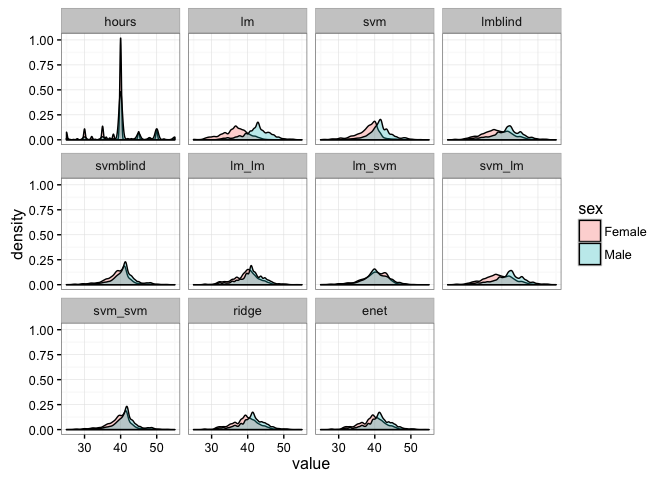

Fairness/causation: Adult dataset
================

Data
----

From the [UCI databases](https://archive.ics.uci.edu/ml/machine-learning-databases/adult/adult.names) Lichman (2013).

``` r
url <- "http://archive.ics.uci.edu/ml/machine-learning-databases/adult/adult.data"
adult <- read.csv(url, strip.white = TRUE, header = FALSE)
names(adult) <- c("age", "workclass", "fnlwgt", "education", "educationnum",
                  "maritalstatus", "occupation", "relationship", "race", "sex",
                  "capitalgain", "capitalloss", "hoursperweek",
                  "nativecountry", "income")
adult$fnlwght <- NULL # Survey weights -- for generalization
data <- adult[,c("workclass", "occupation", "education", "educationnum",
                 "nativecountry", "race", "sex", "age")]
data$hours <- adult$hoursperweek - mean(adult$hoursperweek)
res <- "hours"
prot <- c("sex", "race")
output <- data[,c(prot, res)]
t(head(data))[,1:3]
```

    ##               1               2                  3                  
    ## workclass     "State-gov"     "Self-emp-not-inc" "Private"          
    ## occupation    "Adm-clerical"  "Exec-managerial"  "Handlers-cleaners"
    ## education     "Bachelors"     "Bachelors"        "HS-grad"          
    ## educationnum  "13"            "13"               " 9"               
    ## nativecountry "United-States" "United-States"    "United-States"    
    ## race          "White"         "White"            "White"            
    ## sex           "Male"          "Male"             "Male"             
    ## age           "39"            "50"               "38"               
    ## hours         " -0.4374559"   "-27.4374559"      " -0.4374559"

Imbalances in the data
----------------------

Average outcomes by sex/race.

``` r
data %>% group_by(sex) %>% summarise(count = n(), hours = mean(hours))
```

    ## # A tibble: 2 × 3
    ##      sex count     hours
    ##   <fctr> <int>     <dbl>
    ## 1 Female 10771 -4.027095
    ## 2   Male 21790  1.990630

``` r
data %>% group_by(race) %>% summarise(count = n(), hours = mean(hours))
```

    ## # A tibble: 5 × 3
    ##                 race count      hours
    ##               <fctr> <int>      <dbl>
    ## 1 Amer-Indian-Eskimo   311 -0.3892243
    ## 2 Asian-Pac-Islander  1039 -0.3104106
    ## 3              Black  3124 -2.0146005
    ## 4              Other   271 -0.9688212
    ## 5              White 27816  0.2516439

Distribution plot.

``` r
ggplot(data, aes(hours, linetype = sex)) + geom_density() + theme_bw()
```


### Linear regression

Predicted averages coincide with data averages.

``` r
model.lm <- lm(hours ~ ., data)
output$lm <- predict(model.lm)

model.svm <- svm(hours ~ ., data)
output$svm <- predict(model.svm)
```

### Blinded to unfair covariates

Outcomes are only slightly less biased.

``` r
lm.blind <- fairpred_blind(data, res, prot, method = "lm")
output$lmblind <- predict(lm.blind)

svm.blind <- fairpred_blind(data, res, prot, method = "svm")
output$svmblind <- predict(svm.blind)
```

### Two-stage procedure

Greedily enforces fairness first, then builds predictions.

``` r
lm.lm <- fairpred_2s(data, res, prot, method1 = "lm", method2 = "lm")
output$lm_lm <- predict(lm.lm)

lm.svm <- fairpred_2s(data, res, prot, method1 = "lm", method2 = "svm")
output$lm_svm <- predict(lm.svm)

svm.svm <- fairpred_2s(data, res, prot, method1 = "svm", method2 = "svm")
output$svm_svm <- predict(svm.svm)
```

### Penalizing unprotected coefficients

``` r
ridge <- fairpred_pen(data, res, prot, alpha = 0)
output$ridge <- ridge$predictions

enet <- fairpred_pen(data, res, prot, alpha = .5)
output$enet <- enet$predictions
```

### Comparing imbalance

Subgroup means.

``` r
output %>% group_by(sex) %>%
  summarise_if(.predicate = function(v) is.numeric(v), .funs = funs("mean"))
```

    ## # A tibble: 2 × 11
    ##      sex     hours        lm        svm    lmblind   svmblind     lm_lm
    ##   <fctr>     <dbl>     <dbl>      <dbl>      <dbl>      <dbl>     <dbl>
    ## 1 Female -4.027095 -4.027095 -2.4677566 -1.8926245 -1.3309116 -1.051789
    ## 2   Male  1.990630  1.990630  0.8956853  0.9355419  0.3334879  0.519909
    ##       lm_svm    svm_svm      ridge       enet
    ##        <dbl>      <dbl>      <dbl>      <dbl>
    ## 1 -0.6505907 -0.8938784 -1.3009829 -1.2661855
    ## 2 -0.1176753  0.7332874  0.6493479  0.6309354

``` r
output %>% group_by(race) %>%
  summarise_if(.predicate = function(v) is.numeric(v), .funs = funs("mean"))
```

    ## # A tibble: 5 × 11
    ##                 race      hours         lm        svm     lmblind
    ##               <fctr>      <dbl>      <dbl>      <dbl>       <dbl>
    ## 1 Amer-Indian-Eskimo -0.3892243 -0.3892243 -0.7839648 -0.72201882
    ## 2 Asian-Pac-Islander -0.3104106 -0.3104106 -0.4641845 -0.02226774
    ## 3              Black -2.0146005 -2.0146005 -1.4239083 -1.66195280
    ## 4              Other -0.9688212 -0.9688212 -1.0280113 -0.91267360
    ## 5              White  0.2516439  0.2516439 -0.0578891  0.20444921
    ##     svmblind      lm_lm     lm_svm    svm_svm      ridge       enet
    ##        <dbl>      <dbl>      <dbl>      <dbl>      <dbl>      <dbl>
    ## 1 -0.5915895 -0.7462379 -0.7713912 -0.1803027 -0.7315935 -0.7261415
    ## 2 -0.1473600  0.1353432 -0.1970486  0.2762852  0.3391198  0.2872531
    ## 3 -0.9815879 -1.2287411 -0.8127852 -0.5535697 -1.3936080 -1.3706516
    ## 4 -1.0182687 -0.7303799 -1.1332688 -0.6016333 -0.7959558 -0.7857669
    ## 5 -0.1218372  0.1484030 -0.2257968  0.2880276  0.1646865  0.1629361

Distribution plots.

``` r
pd <- melt(output)
```

    ## Using sex, race as id variables

    ## Warning: attributes are not identical across measure variables; they will
    ## be dropped

``` r
ggplot(pd, aes(value, fill = sex)) + geom_density(alpha = .3) +
  facet_wrap(~variable) + xlim(-15, 15) + theme_bw()
```

    ## Warning: Removed 6944 rows containing non-finite values (stat_density).



``` r
ggplot(pd, aes(value, fill = race)) + geom_density(alpha = .3) +
  facet_wrap(~variable) + xlim(-15, 15) + theme_bw()
```

    ## Warning: Removed 6944 rows containing non-finite values (stat_density).


### Comparing (in-sample) mean-squared prediction error

``` r
outputMSE <- data.frame((output$hours - output[,4:ncol(output)])^2)
outputMSE$const <- output$hours^2
outputMSE %>% summarise_all("mean")
```

    ##         lm      svm  lmblind svmblind    lm_lm   lm_svm  svm_svm    ridge
    ## 1 129.6325 121.8658 132.4799  124.644 134.1809 127.4479 124.7834 133.3288
    ##       enet    const
    ## 1 133.4789 152.4543

Lichman, M. 2013. “UCI Machine Learning Repository.” University of California, Irvine, School of Information; Computer Sciences. <http://archive.ics.uci.edu/ml>.
