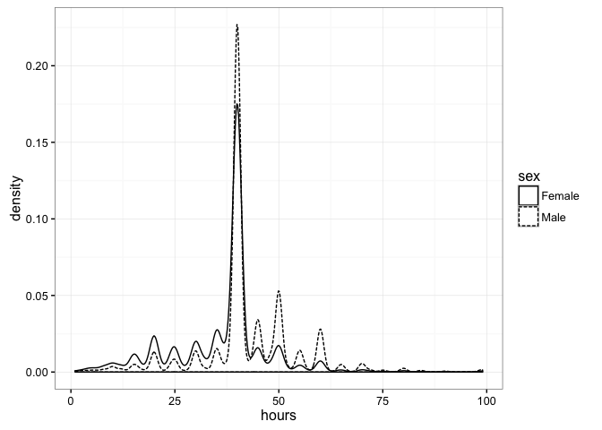

Fairness/causation: Adult dataset
================

Data
----

From the [UCI databases](https://archive.ics.uci.edu/ml/machine-learning-databases/adult/adult.names) Lichman (2013).

``` r
url <- "http://archive.ics.uci.edu/ml/machine-learning-databases/adult/adult.data"
adult <- read.csv(url, strip.white = TRUE, header = FALSE)
names(adult) <- c("age", "workclass", "fnlwgt", "education", "education-num",
                  "marital-status", "occupation", "relationship", "race", "sex",
                  "capital-gain", "capital-loss", "hours-per-week",
                  "native-country", "income")
adult$fnlwght <- NULL # Survey weights -- for generalization
data <- adult[,c("workclass", "occupation", "education", "education-num",
                 "native-country", "race", "sex", "age")]
data$hours <- adult$`hours-per-week`
output <- data
t(head(data))[,1:3]
```

    ##                1               2                  3                  
    ## workclass      "State-gov"     "Self-emp-not-inc" "Private"          
    ## occupation     "Adm-clerical"  "Exec-managerial"  "Handlers-cleaners"
    ## education      "Bachelors"     "Bachelors"        "HS-grad"          
    ## education-num  "13"            "13"               " 9"               
    ## native-country "United-States" "United-States"    "United-States"    
    ## race           "White"         "White"            "White"            
    ## sex            "Male"          "Male"             "Male"             
    ## age            "39"            "50"               "38"               
    ## hours          "40"            "13"               "40"

Imbalances in the data
----------------------

Average outcomes by sex/race.

``` r
data %>% group_by(sex) %>% summarise(count = n(), hours = mean(hours))
```

    ## # A tibble: 2 × 3
    ##      sex count    hours
    ##   <fctr> <int>    <dbl>
    ## 1 Female 10771 36.41036
    ## 2   Male 21790 42.42809

``` r
data %>% group_by(race) %>% summarise(count = n(), hours = mean(hours))
```

    ## # A tibble: 5 × 3
    ##                 race count    hours
    ##               <fctr> <int>    <dbl>
    ## 1 Amer-Indian-Eskimo   311 40.04823
    ## 2 Asian-Pac-Islander  1039 40.12705
    ## 3              Black  3124 38.42286
    ## 4              Other   271 39.46863
    ## 5              White 27816 40.68910

Distribution plot.

``` r
ggplot(data, aes(hours, linetype = sex)) + geom_density() + theme_bw()
```



### Linear regression

Predicted averages coincide with data averages.

``` r
model.lm <- lm(hours ~ ., data)
output$predlm <- predict(model.lm)
```

### Blinded to unfair covariates

Outcomes are only slightly less biased.

``` r
model.blind <- lm(hours ~ .-race-sex, data)
output$predblind <- predict(model.blind)
```

### Two-stage procedure

Is this weird?

``` r
model.s1 <- lm(hours ~ race + sex - 1, data)
data$preds1 <- resid(model.s1)
model.stage2 <- lm(preds1 ~ .-race-sex-hours, data)
output$pred2s <- predict(model.stage2) + mean(data$hours)
```

### Comparing imbalance

``` r
output %>% group_by(sex) %>%
  summarise(actual = mean(hours),
            lm = mean(predlm),
            blinded = mean(predblind),
            twostage = mean(pred2s))
```

    ## # A tibble: 2 × 5
    ##      sex   actual       lm  blinded twostage
    ##   <fctr>    <dbl>    <dbl>    <dbl>    <dbl>
    ## 1 Female 36.41036 36.41036 38.54483 39.38567
    ## 2   Male 42.42809 42.42809 41.37300 40.95736

``` r
output %>% group_by(race) %>%
  summarise(actual = mean(hours),
            lm = mean(predlm),
            blinded = mean(predblind),
            twostage = mean(pred2s))
```

    ## # A tibble: 5 × 5
    ##                 race   actual       lm  blinded twostage
    ##               <fctr>    <dbl>    <dbl>    <dbl>    <dbl>
    ## 1 Amer-Indian-Eskimo 40.04823 40.04823 39.71544 39.69122
    ## 2 Asian-Pac-Islander 40.12705 40.12705 40.41519 40.57280
    ## 3              Black 38.42286 38.42286 38.77550 39.20871
    ## 4              Other 39.46863 39.46863 39.52478 39.70708
    ## 5              White 40.68910 40.68910 40.64191 40.58586

### Comparing prediction error

``` r
output %>%
  summarise(average = mean((hours-mean(hours))^2),
            lm = mean((hours-predlm)^2),
            blinded = mean((hours-predblind)^2),
            twostage = mean((hours-pred2s)^2))
```

    ##    average       lm  blinded twostage
    ## 1 152.4543 129.6325 132.4799 134.1809

Distribution plots by sex.

``` r
pd <- melt(output[,c("sex", "race", "hours", "predlm", "predblind", "pred2s")])
```

    ## Using sex, race as id variables

``` r
ggplot(pd, aes(value, fill = sex)) + geom_density(alpha = .3) +
  facet_wrap(~variable) + xlim(25, 55) + theme_bw()
```

    ## Warning: Removed 6036 rows containing non-finite values (stat_density).


Distribution plots by race.

``` r
ggplot(pd, aes(value, fill = race)) + geom_density(alpha = .3) +
  facet_wrap(~variable) + xlim(25, 55) + theme_bw()
```

    ## Warning: Removed 6036 rows containing non-finite values (stat_density).


``` r
library(e1071)
model.svm <- svm(preds1 ~ .-race-sex-hours, data)
predicted_res <- predict(model.svm, data)
output$pred_svm<-predicted_res+ mean(data$hours)
```

Visualise svm vs. other results

``` r
pd <- melt(output[,c("sex", "race", "hours", "pred2s", "predblind", "pred_svm")])
```

    ## Using sex, race as id variables

``` r
ggplot(pd, aes(value, fill = sex)) + geom_density(alpha = .3) +
  facet_wrap(~variable) + xlim(25, 55) + theme_bw()
```

    ## Warning: Removed 6080 rows containing non-finite values (stat_density).


``` r
ggplot(pd, aes(value, fill = race)) + geom_density(alpha = .3) +
  facet_wrap(~variable) + xlim(25, 55) + theme_bw()
```

    ## Warning: Removed 6080 rows containing non-finite values (stat_density).


``` r
output %>%
  summarise(average = mean((hours-mean(hours))^2),
            lm = mean((hours-predlm)^2),
            blinded = mean((hours-predblind)^2),
            twostage = mean((hours-pred2s)^2),
            twostage_svm= mean((hours-pred_svm)^2))
```

    ##    average       lm  blinded twostage twostage_svm
    ## 1 152.4543 129.6325 132.4799 134.1809      127.735

``` r
output %>% group_by(sex) %>%
  summarise(actual = mean(hours),
            lm = mean(predlm),
            blinded = mean(predblind),
            twostage = mean(pred2s),
            twostage_svm= mean((pred_svm)))
```

    ## # A tibble: 2 × 6
    ##      sex   actual       lm  blinded twostage twostage_svm
    ##   <fctr>    <dbl>    <dbl>    <dbl>    <dbl>        <dbl>
    ## 1 Female 36.41036 36.41036 38.54483 39.38567     39.80094
    ## 2   Male 42.42809 42.42809 41.37300 40.95736     40.30702

``` r
output %>% group_by(race) %>%
  summarise(actual = mean(hours),
            lm = mean(predlm),
            blinded = mean(predblind),
            twostage = mean(pred2s),
            twostage_svm= mean((pred_svm)))
```

    ## # A tibble: 5 × 6
    ##                 race   actual       lm  blinded twostage twostage_svm
    ##               <fctr>    <dbl>    <dbl>    <dbl>    <dbl>        <dbl>
    ## 1 Amer-Indian-Eskimo 40.04823 40.04823 39.71544 39.69122     39.66589
    ## 2 Asian-Pac-Islander 40.12705 40.12705 40.41519 40.57280     40.26540
    ## 3              Black 38.42286 38.42286 38.77550 39.20871     39.60916
    ## 4              Other 39.46863 39.46863 39.52478 39.70708     39.29336
    ## 5              White 40.68910 40.68910 40.64191 40.58586     40.20803

Lichman, M. 2013. “UCI Machine Learning Repository.” University of California, Irvine, School of Information; Computer Sciences. <http://archive.ics.uci.edu/ml>.
